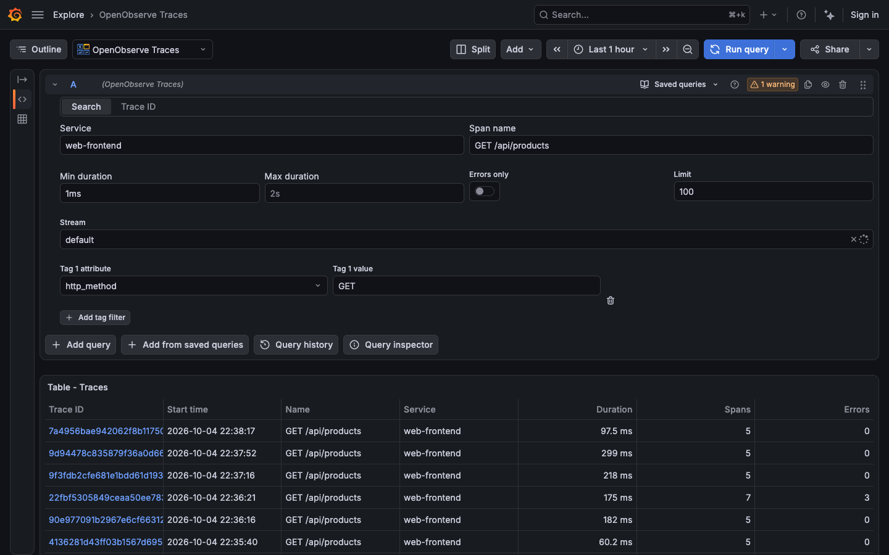
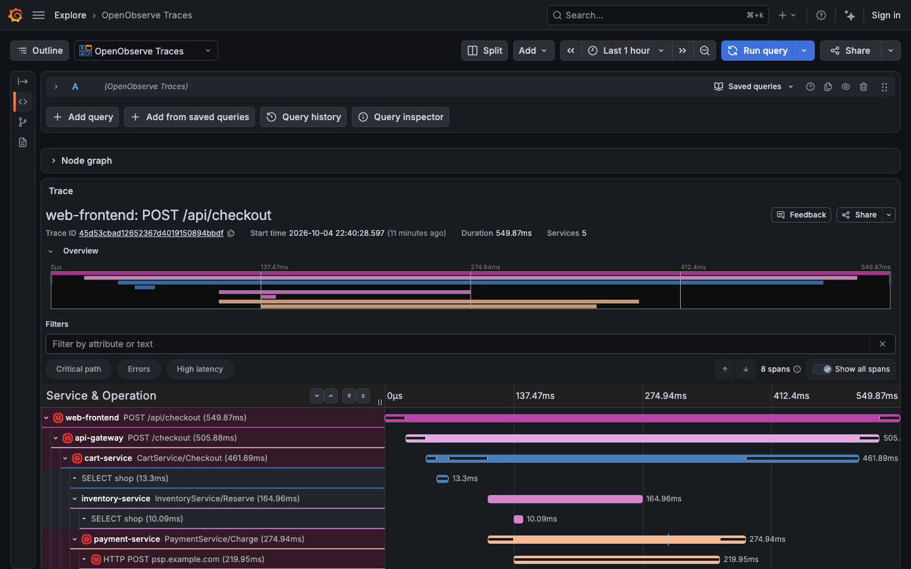

# OpenObserve Traces for Grafana

A Grafana backend datasource that renders traces stored in
[OpenObserve](https://openobserve.ai) using Grafana's native waterfall, span
details and node graph. Search by service, operation, duration, error status or
attributes, then click a trace ID to investigate it and open correlated logs.



## Try the local stack

Requires Node 24, Go 1.26.5 or newer, [Mage](https://magefile.org), and Docker
Compose. The supported Grafana range starts at 12.0.0; the default local image
is 13.2.3.

```bash
npm ci
npm run build
mage buildAll
docker compose up --build -d
docker wait "$(docker compose ps -aq seed)"
docker compose logs seed
```

Wait for a successful seed exit and the `Indexed ... complete traces and
verified correlated Loki logs` message. Open [Grafana](http://localhost:3000),
choose **Explore**, and select **OpenObserve Traces**. The stack includes
OpenObserve, RustFS, an OTel collector, Loki, and seeded traces and logs.
Published ports bind to loopback; the known development credentials and
anonymous Grafana admin access are for local use.

See [environment reference](docs/DEV-ENVIRONMENT.md) for credentials, versions,
seed controls and troubleshooting, or follow the
[manual walkthrough](docs/MANUAL-TESTING.md).

## Query and inspect

- **Search** matches service, span name, error status and attribute filters on
  the same span, while summarizing all spans in each matching trace. Schema
  discovery supplies attribute suggestions; custom attribute names remain
  available if discovery fails.
- **Duration** accepts values such as `100us`, `1.5ms` and `2s`, bare
  microseconds, or template variables. Invalid values show inline feedback.
- **Trace ID** opens the native waterfall with span/resource attributes,
  events, links, kinds and error status.
- **Node graph** shows parent-child relationships between spans in the opened
  trace. It is a span graph, not an aggregate service graph.
- **Trace to logs** uses Grafana's native integration. The local Loki example
  maps `service.name` to `service_name` and filters both trace and span IDs.



Search defaults to 50 traces and permits at most 500. A full page warns that
more results may match. Trace lookup renders at most 5,000 spans, probes one
extra row to detect truncation, and displays a warning when that limit is
exceeded. It widens the selected time range by five minutes on each side.
Pagination, unlimited retrieval and raw SQL input are not provided.

## Configure a datasource

1. Set the OpenObserve base URL, reachable from the Grafana server. In Compose
   this is `http://openobserve:5080`.
2. Select the HTTP authentication required by your deployment. Basic Auth
   passwords, TLS material and custom header values use Grafana secure fields.
3. Set the organization and default traces stream, both `default` locally.
4. Optionally enable the node graph and select a logs datasource. Configure its
   resource-tag mappings, time shifts and trace/span ID filters.
5. Click **Save & test** and confirm **Connected to OpenObserve**.

Production authentication and logs integration depend on the target deployment.
Verify its versions, stream names, TLS and label mappings before rollout.

## Build and test

```bash
npm run typecheck
npm run lint
npm run test:ci
node --test dev/seed/*.test.mjs
go test -race ./pkg/...
npm run e2e
```

The browser suite requires the running, successfully seeded stack. It checks
configuration, search, actual native drill-down, error details, node graph,
matching logs, large-trace truncation, range padding and invalid IDs. CI runs
the suite across supported Grafana versions and nightly.

Use `npm run dev` for frontend watch mode. For a single backend target, run
`mage build:linuxARM64` on Apple Silicon or `mage build:linux` on x86_64.
Restart Grafana after rebuilding its backend binary or changing plugin metadata.
`dist/` is generated and ignored by Git.

## Architecture and API contract

The React editor sends a structured query through `DataSourceWithBackend` to
the Go backend. Grafana's backend HTTP client applies authentication and TLS.
The backend queries OpenObserve, converts its rows into Grafana data frames,
and supplies internal search-result links to the native trace view.

| Purpose                     | OpenObserve endpoint                                 |
| --------------------------- | ---------------------------------------------------- |
| Search and trace lookup     | `POST /api/{org}/_search?type=traces`                |
| Stream discovery and health | `GET /api/{org}/streams?type=traces`                 |
| Attribute suggestions       | `GET /api/{org}/streams/{stream}/schema?type=traces` |

Search uses conditional `HAVING` aggregation by trace ID. Trace lookup selects
the trace's spans ordered by start time. Request time bounds are microseconds
since epoch.

| Grafana field         | OpenObserve source and conversion                                       |
| --------------------- | ----------------------------------------------------------------------- |
| `startTime`           | Absolute `start_time`, magnitude-detected and converted to milliseconds |
| `duration`            | Relative microseconds divided by 1,000                                  |
| `parentSpanID`        | `reference_parent_span_id`; empty for a root                            |
| `kind`, `statusCode`  | Numeric/string span kind and status                                     |
| `tags`, `serviceTags` | Span/resource prefix heuristic, plus canonical resource `service.name`  |
| `logs`, `references`  | Parsed events and links; event timestamps converted to milliseconds     |

Implementation: [frontend](src/), [backend](pkg/plugin/), and
[mapping regression fixture](pkg/plugin/testdata/live_trace_v0.91.2.json).

## Packaging and deployment status

[Validation record](docs/VALIDATION.md) distinguishes current local acceptance,
historical mapping evidence, and remaining production requirements. The refresh
passed local runtime tests on Grafana 12.0.0, 13.0.10 and 13.2.3 with OpenObserve
v0.91.2. Resource classification still uses prefixes. Grafana's Explore host
can scroll horizontally on phone-sized screens.

The [Nightly workflow](.github/workflows/nightly.yml) builds a ZIP on pushes to
`main`. Download its `gresearch-openobservetraces-datasource-nightly` artifact
and extract the inner plugin ZIP into Grafana's plugin directory. Unsigned
development builds require explicitly allowing
`gresearch-openobservetraces-datasource` in Grafana's unsigned-plugin settings.
Restart Grafana after installation.

The [Release workflow](.github/workflows/release.yml) requires a
`GRAFANA_ACCESS_POLICY_TOKEN`, creates a draft release for `v*` tags, and runs
the official validator. Publishing remains subject to namespace ownership,
signing and full validation. The current full validator cannot resolve the
`gresearch` Grafana Cloud organization; this refresh does not change the plugin
ID or claim a signed production release.
